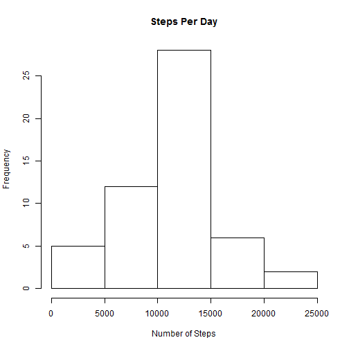
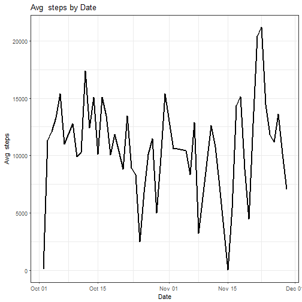
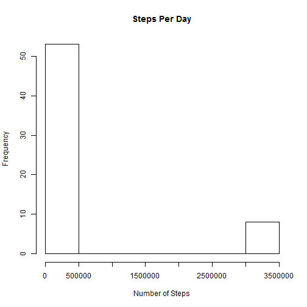
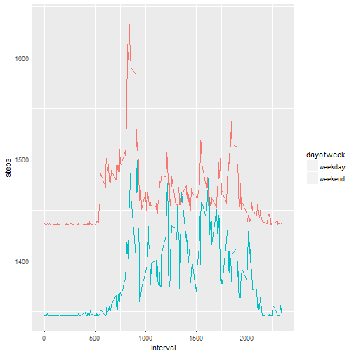

# Reproducible Research: Assignement

#1. Read the data and agregate

```r
dt<-read.csv("activity.csv")
dt$date<-as.Date(dt$date, format = "%Y-%m-%d")
bydate<-aggregate(steps~date,dt,sum)
```
#2 Histogram of steps by day

```r
hist(bydate$steps,xlab="Number of Steps",main="Steps Per Day")
```


#3 Calculate median and mean

```r
mediansteps <- median(bydate$steps,na.rm=TRUE)
meansteps <- mean(bydate$steps,na.rm=TRUE)
```
#4 Average steps plot

```r
avgbydate<-aggregate(steps~date,dt,sum,na.rm=TRUE)
library(ggplot2)
ggplot(avgbydate,aes(x=date,y=steps,group=0)) +
  geom_line( size=1) + 
  labs(title="Avg  steps by Date",x="Date",y="Avg  steps") + 
  theme_bw()
```


#5 Interval with max steps -- 835

```r
avgbyInt<-aggregate(steps~interval,dt,sum,na.rm=TRUE)
intervalmax <- avgbyInt[which.max(avgbyInt$steps),]
```
#6 fill Steps with avgStep

```r
for(i in 1:nrow(dt)) {if (is.na(dt[i,]$steps)) {dt[i,]$steps = meansteps }}
```
#7 histogram with missing values filled

```r
bydatefilled<-aggregate(steps~date,dt,sum)
hist(bydatefilled$steps,xlab="Number of Steps",main="Steps Per Day")
```


#8 Compare average steps for Weekend and weekdays

```r
weekend <- c("Saturday","Sunday")
dayofweek <- weekdays(dt$date)

for (i in 1:length(dayofweek)){
  if (dayofweek[i] %in% weekend){
    dayofweek[i] = "weekend"
  } else {
    dayofweek[i] = "weekday"
  }
}

dtWeek <- cbind(dt,dayofweek)

dtweekday <- subset(dtWeek, dayofweek=="weekday")
dtweekendday <- subset(dtWeek, dayofweek=="weekend")
dtWeekdayInt<-aggregate(steps ~ interval, dtweekday, mean,na.rm=TRUE)
dtWeekendInt<-aggregate(steps ~ interval, dtweekendday, mean,na.rm=TRUE)

dtWeekdayInt$dayofweek<-"weekday"
dtWeekendInt$dayofweek<-"weekend"
dtWeekInt<-rbind(dtWeekdayInt,dtWeekendInt)

ggplot(dtWeekInt, aes(x=interval, y=steps,color=dayofweek)) + 
    geom_line() 
```


